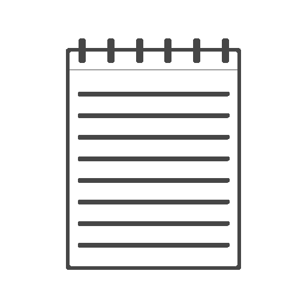
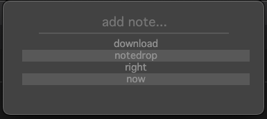

<!-- Improved compatibility of back to top link: See: https://github.com/othneildrew/Best-README-Template/pull/73 -->
<a id="readme-top"></a>
<!--
*** Thanks for checking out the Best-README-Template. If you have a suggestion
*** that would make this better, please fork the repo and create a pull request
*** or simply open an issue with the tag "enhancement".
*** Don't forget to give the project a star!
*** Thanks again! Now go create something AMAZING! :D
-->


<!-- PROJECT SHIELDS -->
<!--
*** I'm using markdown "reference style" links for readability.
*** Reference links are enclosed in brackets [ ] instead of parentheses ( ).
*** See the bottom of this document for the declaration of the reference variables
*** for contributors-url, forks-url, etc. This is an optional, concise syntax you may use.
*** https://www.markdownguide.org/basic-syntax/#reference-style-links
-->
[![Contributors][contributors-shield]][contributors-url]
[![Stargazers][stars-shield]][stars-url]
[![Issues][issues-shield]][issues-url]
<!-- [![project_license][license-shield]][license-url] -->


<!-- PROJECT LOGO -->
<br />
<div align="center">
  <a href="https://github.com/Dalton8804/NoteDrop">
    
  </a>

<h3 align="center">NoteDrop</h3>

  <p align="center">
    MacOS Menubar app to quickly jot down small notes
    <br />
    <a href="https://github.com/Dalton8804/NoteDrop"><strong>Explore the docs »</strong></a>
    <br />
    <br />
    <!-- <a href="https://github.com/Dalton8804/NoteDrop">View Demo</a> -->
    <!-- &middot; -->
    <a href="https://github.com/Dalton8804/NoteDrop/issues/new?labels=bug">Report Bug</a>
    &middot;
    <a href="https://github.com/Dalton8804/NoteDrop/issues/new?labels=enhancement">Request Feature</a>
  </p>
</div>


<!-- TABLE OF CONTENTS -->
<details>
  <summary>Table of Contents</summary>
  <ol>
    <li>
      <a href="#about-the-project">About The Project</a>
      <ul>
        <li><a href="#built-with">Built With</a></li>
      </ul>
    </li>
    <li>
      <a href="#getting-started">Getting Started</a>
      <ul>
        <li><a href="#prerequisites">Prerequisites</a></li>
        <li><a href="#installation">Installation</a></li>
      </ul>
    </li>
    <li><a href="#usage">Usage</a></li>
    <li>
      <a href="#roadmap">Roadmap</a>
      <ul>
        <li><a href='#the-If-I-really-want-to-roadmap'>The "If I really want to" roadmap</a></li>
      </ul>
    </li>
    <!-- <li><a href="#contributing">Contributing</a></li>
    <li><a href="#license">License</a></li> -->
    <li><a href="#contact">Contact</a></li>
    <li><a href="#acknowledgments">Acknowledgments</a></li>
  </ol>
</details>


<!-- ABOUT THE PROJECT -->
## About The Project

<div align="center">
  
</div>

This project is a result of laziness and curiosity. I wanted to know how to make a menubar app for my Mac, I really hated the current quick note solutions since it takes more than .2 seconds to open any given app. So I took it upon myself to fix that. The current project is obviously catered to my needs, but since this is a build it yourself distribution, feel free to change or remove any global keybinds or local paths.

<p align="right">(<a href="#readme-top">back to top</a>)</p>


### Built With

[![Electron-badge]][Electron-url]

<p align="right">(<a href="#readme-top">back to top</a>)</p>


<!-- GETTING STARTED -->
## Getting Started

Currently the only solution is to build this yourself. If you don't like this [let me know](#contact)

### Prerequisites

- MacOS
- [npm](https://docs.npmjs.com/downloading-and-installing-node-js-and-npm)

### Installation

1. Clone the repo
   ```sh
   git clone https://github.com/Dalton8804/NoteDrop.git
   ```
2. Install NPM packages
   ```sh
   npm install
   ```
3. Run npm make and move NoteDrop from `out/` to your Applications
   ```sh
   npm run make
   ```

<p align="right">(<a href="#readme-top">back to top</a>)</p>


<!-- USAGE -->
## Usage

| Command  | Action |
| ------------- | ------------- |
| `Alt+Shift+o`  | Open window  |
| `Enter`  | Add input string as note  |
| `Left Click Note` | Remove note |


<p align="right">(<a href="#readme-top">back to top</a>)</p>


<!-- ROADMAP -->
## Roadmap

- [x] Add/Remove Note
- [x] Create Menubar tray
- [x] Save notes locally
- [ ] Hands free mode
  - [ ] allow opening/writing/closing without mouse
  - [ ] allow removing without mouse
- [ ] custom open/close/remove keybinds

### The "If I really want to" roadmap

- [ ] cli companion tool?
- [ ] save notes to cloud for cross-device usage?

See the [open issues](https://github.com/Dalton8804/NoteDrop/issues) for a full list of proposed features (and known issues).

<p align="right">(<a href="#readme-top">back to top</a>)</p>


<!-- CONTRIBUTING
## Contributing

Contributions are what make the open source community such an amazing place to learn, inspire, and create. Any contributions you make are **greatly appreciated**.

If you have a suggestion that would make this better, please fork the repo and create a pull request. You can also simply open an issue with the tag "enhancement".
Don't forget to give the project a star! Thanks again!

1. Fork the Project
2. Create your Feature Branch (`git checkout -b feature/AmazingFeature`)
3. Commit your Changes (`git commit -m 'Add some AmazingFeature'`)
4. Push to the Branch (`git push origin feature/AmazingFeature`)
5. Open a Pull Request

<p align="right">(<a href="#readme-top">back to top</a>)</p>

### Top contributors:

<a href="https://github.com/Dalton8804/NoteDrop/graphs/contributors">
  
</a> -->


<!-- LICENSE -->
<!-- ## License

Distributed under the project_license. See `LICENSE.txt` for more information.

<p align="right">(<a href="#readme-top">back to top</a>)</p> -->


<!-- CONTACT -->
## Contact

Dalton Avery - dalton@daltonavery.com

Project Link: [https://github.com/Dalton8804/NoteDrop](https://github.com/Dalton8804/NoteDrop)

<p align="right">(<a href="#readme-top">back to top</a>)</p>


<!-- ACKNOWLEDGMENTS -->
<!-- ## Acknowledgments

* []()
* []()
* []() -->

<!-- <p align="right">(<a href="#readme-top">back to top</a>)</p> -->


<!-- MARKDOWN LINKS & IMAGES -->
<!-- https://www.markdownguide.org/basic-syntax/#reference-style-links -->
[contributors-shield]: https://img.shields.io/github/contributors/Dalton8804/NoteDrop.svg?style=for-the-badge
[contributors-url]: https://github.com/Dalton8804/NoteDrop/graphs/contributors
[stars-shield]: https://img.shields.io/github/stars/Dalton8804/NoteDrop.svg?style=for-the-badge
[stars-url]: https://github.com/Dalton8804/NoteDrop/stargazers
[issues-shield]: https://img.shields.io/github/issues/Dalton8804/NoteDrop.svg?style=for-the-badge
[issues-url]: https://github.com/Dalton8804/NoteDrop/issues
[license-shield]: https://img.shields.io/github/license/Dalton8804/NoteDrop.svg?style=for-the-badge
[license-url]: https://github.com/Dalton8804/NoteDrop/blob/master/LICENSE.txt
[product-screenshot]: public/assets/NoteDropscreenshot.png
[Electron-badge]: https://img.shields.io/badge/electron-000000?style=for-the-badge&logo=electron&logoColor=white
[Electron-url]: https://www.electronjs.org/
[Typescript-badge]: https://img.shields.io/badge/Typescript-000000?style=for-the-badge&logo=typescript&logoColor=white
[Typescript-url]: https://www.typescriptlang.org/